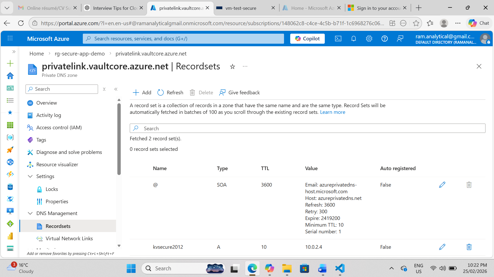
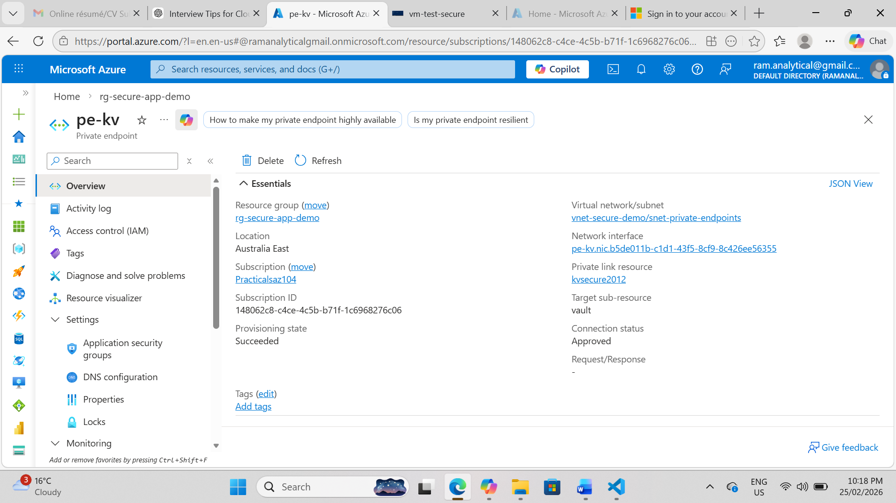

# Azure Secure App Architecture with Terraform

[GitHub Repository](https://github.com/rambabu-eng/azure-secure-app-architecture)

## 1. Project Overview

This project implements a secure-by-design Azure application architecture using Terraform Infrastructure as Code (IaC).

The design focuses on network isolation, identity-based access, secretless authentication, Private Endpoint connectivity, and governed Terraform state management, following enterprise cloud architecture standards.

## 2. Business Problem & Solution

### Business Problem

Applications often rely on public endpoints, stored credentials, and manual configuration. This increases the attack surface, reduces deployment consistency, and complicates compliance in regulated or enterprise environments.

### Solution

This architecture delivers a private and secure Azure PaaS environment where:

* Application identity replaces stored credentials
* Azure SQL Database and Key Vault are accessed through Private Endpoints
* Terraform provides repeatable and governed infrastructure deployment
* Remote Terraform state supports collaboration and controlled infrastructure changes
* Network isolation reduces public exposure of sensitive services

This pattern can be used as a reusable enterprise blueprint for secure Azure application deployments.

## 3. Architecture Summary

This solution deploys:

* Azure Virtual Network (VNet) with segmented subnets
* Azure App Service with System-Assigned Managed Identity
* Azure SQL Database with public network access disabled
* Azure Key Vault for secret management
* Private Endpoints for Azure SQL and Key Vault
* Private DNS Zones for internal name resolution
* RBAC-based access governance
* Remote Terraform backend in Azure Storage
* Git LFS for large file handling
* SSH-based Git authentication for secure repository operations

## 4. Architecture Diagram


The diagram shows the secure application flow across App Service, VNet integration, Private Endpoints, Private DNS Zones, Azure SQL Database, Key Vault, and Terraform remote state.

## 5. Key Screenshots

These screenshots demonstrate the key security and architecture validations implemented in this project.

### 5.1 SQL Database — Public Access Disabled


### 5.2 SQL Private Endpoint


### 5.3 Key Vault — Public Access Disabled


### 5.4 App Service VNet Integration


### 5.5 App Service System-Assigned Managed Identity


### 5.6 Private DNS Zone — SQL A Records


### 5.7 Private DNS Zone — Key Vault A Records



### 5.8 Key Vault Private Endpoint Approved



Additional screenshots are stored in:

```text
docs/screenshots/
```

## 6. Security & Governance Design

### 6.1 Network Security

* Azure SQL Database public network access disabled
* Key Vault public access restricted
* Access to sensitive services enabled through Private Endpoints
* App Service integrated with VNet
* Private DNS Zones configured for internal name resolution

### 6.2 Identity & Access

* App Service uses System-Assigned Managed Identity
* Key Vault access is governed through RBAC
* No secrets are stored in application code
* Access follows least-privilege principles

### 6.3 Secret Management

* Sensitive values are stored in Azure Key Vault
* Secret retrieval is controlled through Azure RBAC
* Connection strings and credentials are not committed to Git

### 6.4 Terraform State Governance

* Terraform state is stored remotely in Azure Storage
* State locking is enabled
* `.tfstate` and `.tfvars` files are excluded through `.gitignore`
* RBAC controls access to infrastructure state and deployment operations

## 7. Terraform Implementation

### 7.1 IaC Structure

Terraform configuration is organized by concern:

* `networking.tf` — VNet and subnets
* `appservice.tf` — App Service and Managed Identity
* `sql.tf` — SQL Server and SQL Database
* `keyvault.tf` — Key Vault and RBAC
* `private-endpoints.tf` — Private Endpoints
* `dns.tf` — Private DNS Zones
* `rbac.tf` — Role assignments
* `backend.tf` — Remote backend configuration
* `variables.tf` — Input variables
* `versions.tf` — Provider version constraints
* `outputs.tf` — Key deployment outputs

### 7.2 Remote Backend

Remote state provides:

* Centralized state management
* State locking
* CI/CD readiness
* Safer team collaboration
* Better infrastructure governance

## 8. Repository Structure

```text
.
├── appservice.tf
├── backend.tf
├── dns.tf
├── keyvault.tf
├── main.tf
├── networking.tf
├── outputs.tf
├── private-endpoints.tf
├── provider.tf
├── rbac.tf
├── sql.tf
├── test-vm-bastion.tf
├── variables.tf
├── versions.tf
├── docs/
│   ├── architecture_diagram/
│   │   └── azure-secure-app-architecture.png
│   └── screenshots/
│       ├── appservice-vnet-integration.png
│       ├── keyvault-public-access-disabled.png
│       ├── sql-private-endpoint.png
│       ├── sql-public-access-disabled.png
│       └── additional validation screenshots
└── README.md
```

This structure keeps infrastructure code, architecture diagrams, and validation evidence clearly separated and reusable for future projects.

## 9. Deployment Workflow

### 9.1 Prerequisites

* Terraform installed
* Azure CLI installed and authenticated
* Azure subscription access
* Remote backend storage account and container created or bootstrapped
* Required RBAC permissions assigned

### 9.2 Deployment Steps

Initialize Terraform:

```bash
terraform init
```

Review the deployment plan:

```bash
terraform plan
```

Apply the infrastructure:

```bash
terraform apply
```

Validate the deployment:

* Confirm App Service Managed Identity
* Confirm App Service VNet Integration
* Confirm SQL public network access is disabled
* Confirm SQL Private Endpoint is approved
* Confirm Key Vault public access is restricted
* Confirm Private DNS records are created
* Confirm Terraform remote state is stored in Azure Storage

## 10. Operations & Monitoring

Current and planned operational practices include:

* App Service logs and metrics
* Private Endpoint connectivity validation
* RBAC review for least privilege
* Terraform plan review before apply
* Azure Monitor and Log Analytics integration
* Diagnostic settings for platform visibility
* Future alerting for security and availability signals

## 11. Git & Repository Engineering

This repository includes:

* Git LFS for large PNG assets
* SSH authentication for secure Git operations
* Hardened `.gitignore` excluding:

  * `.tfstate`
  * `.tfstate.backup`
  * `.tfvars`
  * `.terraform/`
  * Local tooling artifacts
* No sensitive files committed to the repository

## 12. Key Learning Outcomes

This project demonstrates hands-on capability in:

* Secure Azure PaaS architecture design
* Private Endpoint networking
* Private DNS integration
* Managed Identity and RBAC-based access
* Azure Key Vault secret management
* Terraform remote backend configuration
* Git LFS and repository hygiene
* Enterprise-style Infrastructure as Code practices

## 13. Environment Teardown

To remove all deployed resources:

```bash
terraform destroy
```

> Review the Terraform plan carefully before destroying resources.

## 14. Future Enhancements

Planned improvements:

* GitHub Actions CI/CD with OIDC
* Dev, test, and prod environment separation
* Private Endpoint for Terraform state storage
* Azure Storage versioning and soft delete
* Full Azure Monitor and Log Analytics integration
* Diagnostic settings and alert rules
* Cost monitoring and budget alerts

## 15. Author

**Rambabu Katta**
Azure Cloud Engineer | Terraform | Azure Networking | DevOps
Melbourne, Australia
