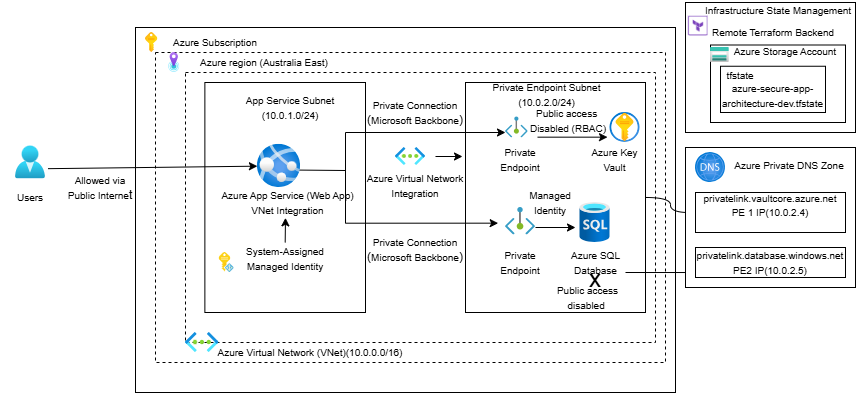
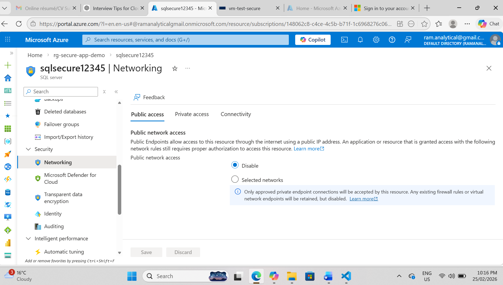
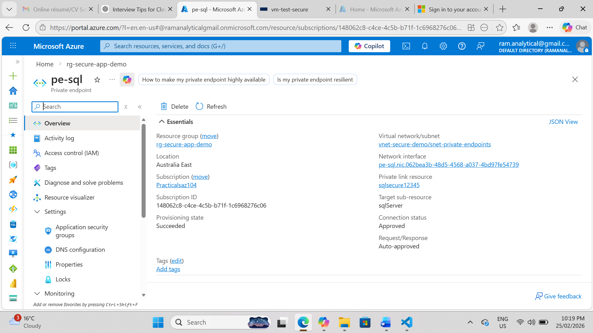
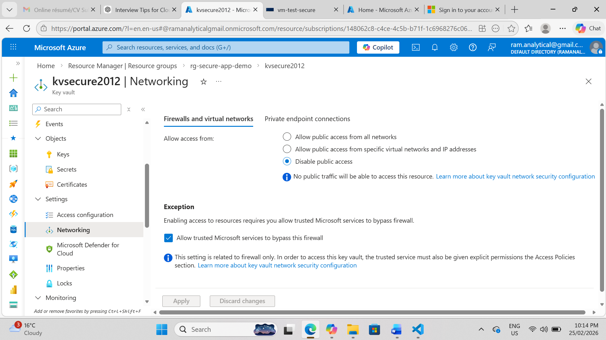
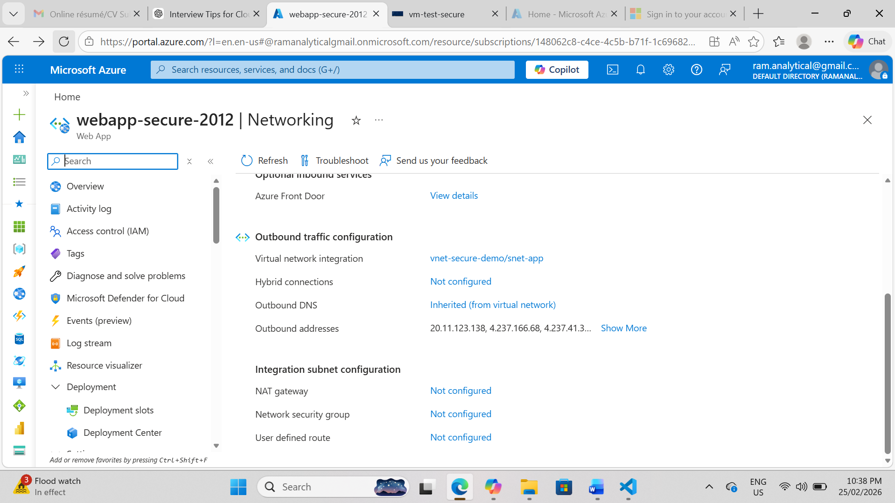
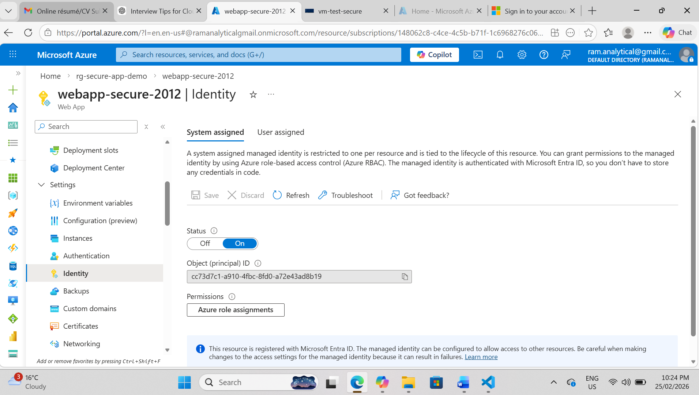
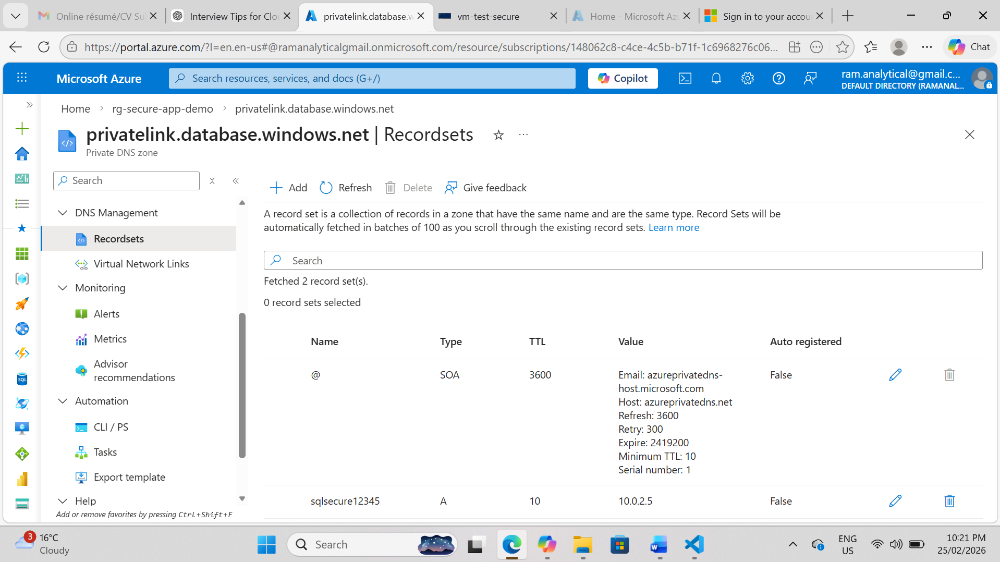

# Azure Secure App Architecture with Terraform

Enterprise-grade private Azure architecture built with Terraform. This project demonstrates secure Azure PaaS deployment using App Service Managed Identity, VNet Integration, Private Endpoints, Private DNS, Azure SQL, Key Vault, and governed Terraform remote state.

## Repository

[GitHub Repository](https://github.com/rambabu-eng/azure-secure-app-architecture)

## Project Overview

This project implements a secure-by-design Azure application architecture using Terraform Infrastructure as Code.

The design focuses on:

* Private networking
* Identity-based access
* Secretless authentication
* Private Endpoint connectivity
* Private DNS resolution
* Remote Terraform state governance
* Least-privilege access using Azure RBAC

## Tech Stack

| Area                   | Technologies / Services                             |
| ---------------------- | --------------------------------------------------- |
| Cloud Platform         | Microsoft Azure                                     |
| Infrastructure as Code | Terraform                                           |
| Compute                | Azure App Service                                   |
| Database               | Azure SQL Database                                  |
| Secret Management      | Azure Key Vault                                     |
| Networking             | VNet, Subnets, Private Endpoints, Private DNS Zones |
| Identity & Access      | Managed Identity, Azure RBAC, Microsoft Entra ID    |
| State Management       | Terraform Remote Backend, Azure Storage             |
| Repository             | GitHub, Git LFS, SSH Authentication                 |
| Validation             | Azure Portal, Azure CLI, Terraform CLI              |

## Business Problem

Applications that rely on public endpoints, stored credentials, and manual configuration increase the attack surface and reduce deployment consistency. In enterprise or regulated environments, infrastructure must be repeatable, governed, auditable, and secure by design.

## Solution

This solution provides a private Azure PaaS architecture where:

* App Service uses Managed Identity instead of stored credentials
* Azure SQL and Key Vault are accessed through Private Endpoints
* Public exposure is reduced for sensitive services
* Private DNS supports internal name resolution
* Terraform provides repeatable infrastructure deployment
* Remote backend supports state governance and collaboration

## Solution Architecture

This architecture deploys:

* Azure Virtual Network with segmented subnets
* Azure App Service with System-Assigned Managed Identity
* Azure SQL Database with public access disabled
* Azure Key Vault for secure secret management
* Private Endpoints for SQL and Key Vault
* Private DNS Zones for internal resolution
* Azure RBAC for access governance
* Remote Terraform backend in Azure Storage

## Architecture Diagram



## Key Screenshots

The screenshots below show the main security and architecture validations for this project.

### SQL Database — Public Access Disabled



### SQL Private Endpoint



### Key Vault — Public Access Disabled



### App Service VNet Integration



### App Service System-Assigned Managed Identity



### Private DNS Zone — SQL A Records



Additional validation screenshots are available in the `docs/screenshots/` folder.

## Security & Governance Design

### Network Security

* Azure SQL public network access disabled
* Key Vault public access restricted
* Private Endpoints used for SQL and Key Vault
* App Service integrated with VNet
* Private DNS configured for internal resolution

### Identity & Access

* App Service uses System-Assigned Managed Identity
* Azure RBAC controls access to Key Vault and resources
* No secrets stored in application code
* Least-privilege access principles applied

### Terraform State Governance

* Terraform state stored remotely in Azure Storage
* State locking enabled
* Sensitive local files excluded using `.gitignore`
* Remote backend supports safer collaboration and CI/CD readiness

## Terraform File Structure

| File                   | Purpose                                    |
| ---------------------- | ------------------------------------------ |
| `provider.tf`          | Azure provider configuration               |
| `versions.tf`          | Terraform and provider version constraints |
| `variables.tf`         | Input variables                            |
| `main.tf`              | Core resource references                   |
| `networking.tf`        | VNet and subnet configuration              |
| `appservice.tf`        | App Service and Managed Identity           |
| `sql.tf`               | Azure SQL Server and Database              |
| `keyvault.tf`          | Azure Key Vault configuration              |
| `private-endpoints.tf` | Private Endpoints for SQL and Key Vault    |
| `dns.tf`               | Private DNS Zones and links                |
| `rbac.tf`              | Role assignments                           |
| `backend.tf`           | Remote backend configuration               |
| `outputs.tf`           | Deployment outputs                         |
| `test-vm-bastion.tf`   | Test VM/Bastion validation resources       |

## Repository Structure

```text
.
├── .gitattributes
├── .gitignore
├── .terraform.lock.hcl
├── LICENSE
├── README.md
├── appservice.tf
├── backend.tf
├── dns.tf
├── keyvault.tf
├── main.tf
├── networking.tf
├── outputs.tf
├── private-endpoints.tf
├── provider.tf
├── rbac.tf
├── sql.tf
├── test-vm-bastion.tf
├── variables.tf
├── versions.tf
└── docs/
    ├── architecture_diagram/
    │   └── azure-secure-app-architecture.png
    └── screenshots/
        ├── Webapp_Identity_Systemassigned.png
        ├── Privatednszone_Sqldb_A_Records.png
        ├── appservice-vnet-integration.png
        ├── keyvault-public-access-disabled.png
        ├── sql-private-endpoint.png
        └── sql-public-access-disabled.png
```

## Deployment Workflow

### Prerequisites

* Terraform installed
* Azure CLI installed and authenticated
* Azure subscription access
* Remote backend storage configured
* Required Azure RBAC permissions assigned

### Terraform Commands

```bash
terraform init
terraform plan
terraform apply
```

### Validation Checklist

* Confirm App Service Managed Identity is enabled
* Confirm App Service VNet Integration is configured
* Confirm SQL public network access is disabled
* Confirm SQL Private Endpoint is approved
* Confirm Key Vault access is restricted
* Confirm Private DNS records are created
* Confirm Terraform state is stored remotely

## Operations & Monitoring

Current and planned operational practices:

* Terraform plan review before apply
* Private Endpoint connectivity validation
* Azure RBAC review for least privilege
* App Service logs and metrics
* Azure Monitor and Log Analytics integration
* Diagnostic settings and alerting as future enhancements

## Key Learning Outcomes

This project demonstrates:

* Secure Azure PaaS architecture design
* Terraform Infrastructure as Code implementation
* Azure Private Endpoint networking
* Private DNS integration
* Managed Identity and RBAC access control
* Key Vault secret management
* Remote Terraform state governance
* GitHub repository hygiene with Git LFS and SSH

## Environment Teardown

To remove deployed resources:

```bash
terraform destroy
```

Review the Terraform destroy plan carefully before confirming.

## Future Enhancements

* GitHub Actions CI/CD with OIDC
* Dev/test/prod environment separation
* Private Endpoint for Terraform backend storage
* Storage versioning and soft delete
* Azure Monitor and Log Analytics integration
* Diagnostic settings and alert rules
* Cost monitoring and budget alerts

## Author

**Rambabu Katta**
Azure Cloud Engineer | Terraform | Azure Networking | DevOps
Melbourne, Australia
